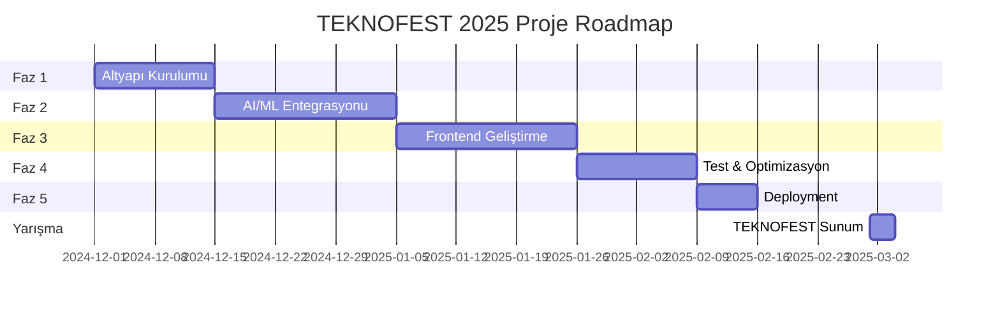

# TEKNOFEST 2025 - Eğitim Teknolojileri Projesi
## 📋 Proje Gereksinimleri ve Tasarım Dokümantasyonu

---

## 1. 🎯 PROJE ÖZETİ

### Vizyon
Türkiye'nin eğitim sistemini yapay zeka destekli, kişiselleştirilmiş öğrenme platformu ile dijital dönüşüme uğratmak.

### Misyon
MEB müfredatına uyumlu, adaptif öğrenme yolları sunan, öğrenci-öğretmen-veli üçgenini güçlendiren akıllı eğitim asistanı geliştirmek.

### Hedef Kitle
- **Birincil**: 9-12. sınıf öğrencileri
- **İkincil**: Öğretmenler ve eğitmenler
- **Üçüncül**: Veliler ve eğitim yöneticileri

---

## 2. 📊 FONKSİYONEL GEREKSİNİMLER

### 2.1 Temel Özellikler (Core Features)

#### A. Kişiselleştirilmiş Öğrenme
- [ ] VARK öğrenme stili tespiti
- [ ] Adaptif öğrenme yolu oluşturma
- [ ] ZPD (Zone of Proximal Development) tabanlı içerik
- [ ] Bireysel ilerleme takibi

#### B. Yapay Zeka Destekli Eğitim
- [ ] Türkçe doğal dil işleme (NLP)
- [ ] Soru cevaplama sistemi
- [ ] Otomatik quiz oluşturma
- [ ] İçerik önerisi

#### C. Değerlendirme ve Analitik
- [ ] IRT (Item Response Theory) bazlı değerlendirme
- [ ] Performans analitiği
- [ ] Zayıf/güçlü yön analizi
- [ ] İlerleme raporları

#### D. İçerik Yönetimi
- [ ] MEB müfredatı entegrasyonu
- [ ] Multimedya içerik desteği
- [ ] İnteraktif simülasyonlar
- [ ] Çevrimdışı erişim

### 2.2 İleri Seviye Özellikler (Advanced Features)

#### A. Sosyal Öğrenme
- [ ] Akran eşleştirme
- [ ] Grup projeleri
- [ ] Tartışma forumları
- [ ] Mentörlük sistemi

#### B. Oyunlaştırma
- [ ] Puan ve rozet sistemi
- [ ] Liderlik tablosu
- [ ] Seviye sistemi
- [ ] Başarı ödülleri

#### C. Entegrasyonlar
- [ ] EBA entegrasyonu
- [ ] Google Classroom
- [ ] Microsoft Teams
- [ ] Zoom/Meet entegrasyonu

---

## 3. 💻 TEKNİK GEREKSİNİMLER

### 3.1 Performans Gereksinimleri
```yaml
Yanıt Süresi:
  - API çağrıları: < 200ms
  - Sayfa yükleme: < 2s
  - Quiz oluşturma: < 5s
  - Model çıkarımı: < 1s

Ölçeklenebilirlik:
  - Eşzamanlı kullanıcı: 10,000+
  - Günlük işlem: 1M+
  - Veri depolama: 100TB+
  - Uptime: %99.9
```

### 3.2 Güvenlik Gereksinimleri
- **Kimlik Doğrulama**: OAuth 2.0, JWT
- **Veri Şifreleme**: AES-256, TLS 1.3
- **KVKK Uyumluluğu**: Veri anonimleştirme
- **Yedekleme**: Günlük, 3-2-1 stratejisi
- **DDoS Koruması**: CloudFlare
- **Rate Limiting**: IP başına 100 istek/dakika

### 3.3 Platform Gereksinimleri
```yaml
Web:
  - Modern tarayıcılar (Chrome, Firefox, Safari, Edge)
  - Responsive tasarım
  - Progressive Web App (PWA)

Mobil:
  - iOS 12+ / Android 8+
  - Native apps (React Native)
  - Offline mode

Backend:
  - Python 3.11+
  - Node.js 18+ (opsiyonel)
  - PostgreSQL 15+
  - Redis cache
```

---

## 4. 🏗️ SİSTEM MİMARİSİ

### 4.1 Katmanlı Mimari

```
┌─────────────────────────────────────────────┐
│           Sunum Katmanı (Frontend)          │
│    React/Next.js - Mobile Apps - PWA        │
├─────────────────────────────────────────────┤
│           API Gateway (Kong/Nginx)          │
│      Rate Limiting - Auth - Routing         │
├─────────────────────────────────────────────┤
│         İş Mantığı Katmanı (Backend)       │
│   FastAPI - Django - MCP Server - Celery    │
├─────────────────────────────────────────────┤
│           AI/ML Servisleri                  │
│   HuggingFace - Claude API - Custom Models  │
├─────────────────────────────────────────────┤
│           Veri Katmanı                      │
│   PostgreSQL - MongoDB - Redis - S3         │
└─────────────────────────────────────────────┘
```

### 4.2 Mikroservis Mimarisi

```yaml
Services:
  auth-service:
    - Kullanıcı kimlik doğrulama
    - JWT token yönetimi
    - Rol bazlı yetkilendirme

  learning-service:
    - Öğrenme yolu oluşturma
    - İçerik önerisi
    - İlerleme takibi

  assessment-service:
    - Quiz oluşturma
    - IRT analizi
    - Performans değerlendirme

  content-service:
    - İçerik yönetimi
    - Multimedya işleme
    - CDN entegrasyonu

  notification-service:
    - Email/SMS gönderimi
    - Push notifications
    - Webhook yönetimi

  analytics-service:
    - Veri toplama
    - Raporlama
    - Dashboard
```

### 4.3 Teknoloji Stack'i

```yaml
Frontend:
  Framework: React 18 / Next.js 14
  State Management: Redux Toolkit / Zustand
  UI Library: Material-UI / Ant Design
  Styling: Tailwind CSS
  Charts: Recharts / D3.js
  Testing: Jest, React Testing Library

Backend:
  Framework: FastAPI / Django REST
  ORM: SQLAlchemy / Django ORM
  Task Queue: Celery + Redis
  WebSocket: Socket.io
  Testing: Pytest, Unittest

AI/ML:
  Framework: PyTorch / TensorFlow
  Models: Transformers (HuggingFace)
  NLP: spaCy, NLTK
  Deployment: TorchServe / TF Serving

Database:
  Primary: PostgreSQL 15
  NoSQL: MongoDB
  Cache: Redis
  Search: Elasticsearch
  Storage: MinIO / AWS S3

DevOps:
  Containerization: Docker
  Orchestration: Kubernetes
  CI/CD: GitHub Actions / GitLab CI
  Monitoring: Prometheus + Grafana
  Logging: ELK Stack
```

---

## 5. 📝 DETAYLI GÖREV LİSTELERİ

### 5.1 Faz 1: Temel Altyapı (2 Hafta)

#### Hafta 1: Proje Kurulumu
- [ ] Git repository oluşturma
- [ ] Development environment setup
- [ ] Docker compose yapılandırması
- [ ] CI/CD pipeline kurulumu
- [ ] Dokümantasyon yapısı

#### Hafta 2: Veritabanı ve API
- [ ] PostgreSQL schema tasarımı
- [ ] FastAPI boilerplate
- [ ] Kimlik doğrulama sistemi
- [ ] Temel CRUD operasyonları
- [ ] API dokümantasyonu (Swagger)

### 5.2 Faz 2: AI/ML Entegrasyonu (3 Hafta)

#### Hafta 3: Model Hazırlığı
- [ ] Türkçe NLP model seçimi
- [ ] Fine-tuning için veri hazırlama
- [ ] Model eğitimi ve optimizasyonu
- [ ] Model deployment servisi
- [ ] A/B test altyapısı

#### Hafta 4: Öğrenme Algoritmaları
- [ ] VARK tespit algoritması
- [ ] ZPD hesaplama modülü
- [ ] IRT implementasyonu
- [ ] Öneri sistemi
- [ ] Adaptif quiz algoritması

#### Hafta 5: MCP Entegrasyonu
- [ ] MCP server setup
- [ ] Tool implementasyonu
- [ ] Resource tanımları
- [ ] Claude Desktop config
- [ ] Test ve debugging

### 5.3 Faz 3: Frontend Geliştirme (3 Hafta)

#### Hafta 6: UI/UX Tasarım
- [ ] Wireframe oluşturma
- [ ] Design system kurulumu
- [ ] Component library
- [ ] Responsive layout
- [ ] Accessibility (a11y)

#### Hafta 7: Core Features
- [ ] Kullanıcı dashboard
- [ ] Öğrenme yolu görünümü
- [ ] Quiz interface
- [ ] İlerleme grafikleri
- [ ] Profil yönetimi

#### Hafta 8: İleri Özellikler
- [ ] Gerçek zamanlı sohbet
- [ ] Video player entegrasyonu
- [ ] Offline mode
- [ ] Push notifications
- [ ] PWA özellikleri

### 5.4 Faz 4: Test ve Optimizasyon (2 Hafta)

#### Hafta 9: Test
- [ ] Unit test coverage (%80+)
- [ ] Integration testing
- [ ] E2E testing (Cypress)
- [ ] Performance testing
- [ ] Security testing

#### Hafta 10: Optimizasyon
- [ ] Database query optimization
- [ ] Caching stratejisi
- [ ] CDN entegrasyonu
- [ ] Image optimization
- [ ] Bundle size reduction

### 5.5 Faz 5: Deployment ve Launch (1 Hafta)

#### Hafta 11: Production Deployment
- [ ] Kubernetes cluster setup
- [ ] SSL sertifikaları
- [ ] Domain yapılandırması
- [ ] Monitoring kurulumu
- [ ] Backup stratejisi

---

## 6. 🎯 PROJE MİL TAŞLARI



---

## 7. 🚦 BAŞARI KRİTERLERİ (KPI)

### Teknik Metrikler
- **Sistem Uptime**: > %99.9
- **Ortalama Yanıt Süresi**: < 200ms
- **Eşzamanlı Kullanıcı**: > 10,000
- **Test Coverage**: > %80
- **Bug Yoğunluğu**: < 0.5 bug/KLOC

### İş Metrikleri
- **Kullanıcı Memnuniyeti**: > 4.5/5
- **Günlük Aktif Kullanıcı**: > 1,000
- **Öğrenme Hedefi Tamamlama**: > %70
- **Quiz Başarı Artışı**: > %25
- **Öğretmen Onayı**: > %85

### Eğitim Metrikleri
- **Öğrenme Verimliliği**: %30 artış
- **Konu Kavrama Hızı**: %40 iyileşme
- **Test Başarısı**: %35 artış
- **Motivasyon Skoru**: %50 artış
- **Tamamlama Oranı**: > %75

---

## 8. 🚀 BAŞLANGIÇ ADIMLARI

### Öncelik 1 (Bu Hafta)
1. **Veri hazırlama**: Competition dataset temizleme
2. **Model fine-tuning**: Qwen modeli eğitimi
3. **API servisi**: FastAPI ile endpoint'ler
4. **MCP entegrasyonu**: Claude Desktop yapılandırması

### Öncelik 2 (Gelecek Hafta)
1. **Frontend başlangıç**: React projesi kurulumu
2. **Veritabanı tasarımı**: PostgreSQL schema
3. **Authentication**: JWT implementasyonu
4. **Docker setup**: Development environment

### Öncelik 3 (2 Hafta Sonra)
1. **Test altyapısı**: Jest, Pytest kurulumu
2. **CI/CD**: GitHub Actions workflow
3. **Monitoring**: Prometheus entegrasyonu
4. **Documentation**: API ve kullanım dokümantasyonu

---

## 9. 🔧 RİSK YÖNETİMİ

### Teknik Riskler
| Risk | Olasılık | Etki | Azaltma Stratejisi |
|------|----------|------|-------------------|
| Model performansı yetersiz | Orta | Yüksek | Multiple model ensemble |
| Ölçeklenme sorunları | Düşük | Yüksek | Auto-scaling, load balancing |
| Veri güvenliği ihlali | Düşük | Çok Yüksek | Encryption, audit logs |
| API rate limiting | Orta | Orta | Caching, queue system |

### Proje Riskleri
| Risk | Olasılık | Etki | Azaltma Stratejisi |
|------|----------|------|-------------------|
| Zaman yetersizliği | Orta | Yüksek | MVP odaklı geliştirme |
| Kaynak eksikliği | Düşük | Orta | Open source kullanımı |
| Requirement değişikliği | Orta | Orta | Agile metodoloji |
| İletişim sorunları | Düşük | Orta | Daily standup, Slack |

---

## 10. 📞 İLETİŞİM VE SORUMLULUKLAR

### Takım Yapısı
```yaml
Proje Yöneticisi:
  - Genel koordinasyon
  - Timeline takibi
  - Raporlama

Backend Developer:
  - API geliştirme
  - Database yönetimi
  - Entegrasyonlar

AI/ML Engineer:
  - Model geliştirme
  - Fine-tuning
  - Deployment

Frontend Developer:
  - UI/UX implementasyonu
  - State management
  - Testing

DevOps Engineer:
  - Infrastructure
  - CI/CD
  - Monitoring
```

### İletişim Kanalları
- **Slack**: Günlük iletişim
- **GitHub**: Kod review, issue tracking
- **Jira**: Task management
- **Confluence**: Dokümantasyon
- **Google Meet**: Haftalık toplantılar

---

## 11. 📚 KAYNAKLAR VE REFERANSLAR

### Teknik Dokümantasyon
- [FastAPI Documentation](https://fastapi.tiangolo.com/)
- [React Documentation](https://react.dev/)
- [HuggingFace Transformers](https://huggingface.co/docs)
- [MCP Protocol Spec](https://modelcontextprotocol.io/)

### Eğitim Kaynakları
- MEB Müfredat Programları
- EBA İçerik Kataloğu
- PISA Değerlendirme Kriterleri
- UNESCO Eğitim Standartları

### Araştırmalar
- "Adaptive Learning Systems" - IEEE 2023
- "AI in Education" - Nature 2024
- "Personalized Learning Paths" - ACM 2023
- "Turkish NLP Challenges" - EMNLP 2024

---

## 12. 🎯 SONUÇ VE EYLEM PLANI

### Hemen Başlanacaklar
1. Repository ve proje yapısı ✓
2. MCP server implementasyonu ✓
3. Learning Path Agent ✓
4. Dataset hazırlama ✓

### Bu Hafta Tamamlanacaklar
1. Model fine-tuning başlat
2. FastAPI servisi kur
3. PostgreSQL schema tasarla
4. Frontend boilerplate oluştur

### Gelecek Hafta Hedefleri
1. Authentication sistemi
2. Quiz generation modülü
3. Dashboard UI
4. Test altyapısı

---

**Son Güncelleme**: 2025-08-20
**Versiyon**: 1.0.0
**Hazırlayan**: TEKNOFEST 2025 Eğitim Teknolojileri Takımı